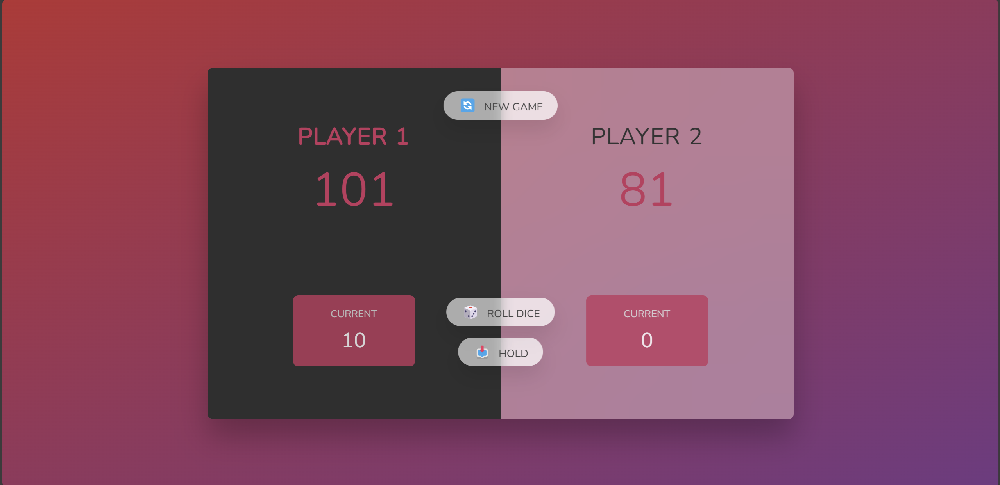

 
## About The Project

  <h1 align="center">Pig Game</h1>
  

    A simple browser-based game implemented with HTML, CSS, and JavaScript.
    The game is based on the classic "Pig Game" dice-rolling game where players take turns rolling a die and accumulating points, 
    but if they roll a 1, they lose their accumulated points for that turn.
  

### Features

- Two-player gameplay.
- Roll the die to accumulate points.
- If you roll a 1, you lose the points accumulated during the turn.
- Players can choose to "hold" to keep the points accumulated in a round and end their turn.
- The first player to reach 100 points wins.

---

### Technologies Used

- **HTML** for the game structure.
- **CSS** for styling the game interface.
- **JavaScript** for game logic.

